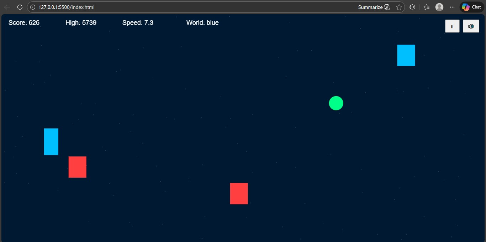

# 🎮 Phase Shift Runner



**Phase Shift Runner** is a fast-paced dimension switching arcade runner game where players must survive by shifting between worlds to avoid obstacles.

The game gradually becomes faster, challenging the player's reaction speed and focus.

---

## 🌍 Game Concept

The player exists in two worlds:

- 🔵 Blue Dimension
- 🔴 Red Dimension

Obstacles belong to a specific world.  
If the player stays in the same world as the obstacle, the game ends.

Players must constantly switch dimensions to survive.

---

## 🌐 Live Demo

🎮 **Play Now:**  
https://phase-shift-runner.vercel.app

---

## ✨ Game Features

### 🌐 Dimension Switching
Switch between worlds in real time to avoid obstacles.

### ⚡ Increasing Speed
Game speed increases gradually, making survival harder.

### 🛡 Shield Power-Up
Collect green orbs to activate shield protection for one hit.

### 🏆 High Score System
Best score is stored locally for replay motivation.

### ⏸ Pause System
Pause and resume gameplay anytime.

### 🔊 Sound Toggle
Turn game music on or off instantly.

### 📱 Responsive Canvas
Game automatically fits desktop and mobile screens.

---

## 🎮 Controls

### Desktop Controls
| Action | Key |
|--------|-----|
| Change Dimension | Space |
| Pause Game | P |
| Sound On/Off | M |

### Mobile Controls
| Action | Control |
|--------|---------|
| Change Dimension | Tap Screen |

---

## 📂 Project Structure
```
phase-shift-runner/
│
├── index.html
├── src/
│ └── game.js
│
├── assets/
│ ├── sounds/
│ └── images/
│ └── preview.jpg
│
├── .gitignore
└── README.md
```
---

## 🚀 Current Status

✅ Core gameplay completed  
✅ Dimension switching system  
✅ Shield power-up system  
✅ Speed scaling  
✅ High score system  
✅ Pause & sound controls  
✅ Responsive canvas

Game is playable and ready for improvements.

---

## 🔮 Possible Future Improvements

- Boss obstacles
- Combo scoring
- Visual hit effects
- Mobile control buttons
- Online leaderboard

---

## 👨‍💻 Developer

Tasdid Siam